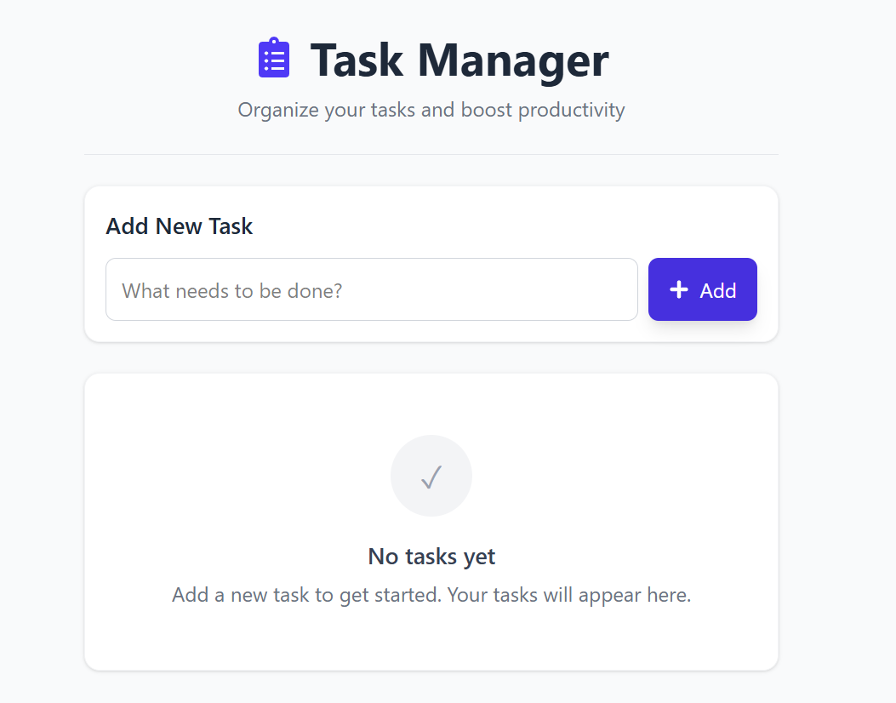

# 📝 React To-Do List App

This is a simple and responsive To-Do List application built using **React**, **Vite**, and **Tailwind CSS**.
It allows users to **add**, **edit**, **delete**, and **mark tasks as completed**.

---

## 🚀 Features

- Add new tasks
- Mark tasks as complete/incomplete
- Edit task titles
- Delete tasks
- Responsive design using Tailwind CSS
- 

---

## 📦 Technologies Used

- React
- Vite
- Tailwind CSS
- UUID
- react-icon/fa

---

## 🛠️ How to Run the Application

### 1. Clone the repository:

```bash
https://github.com/GitAvinash003/react-todo-app.git
cd react-todo-app
```
